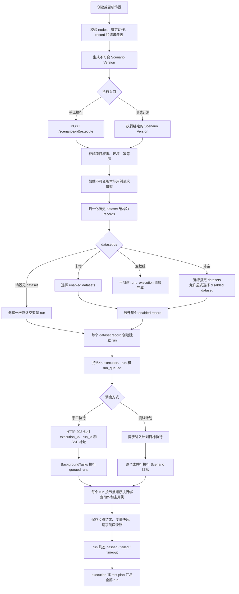
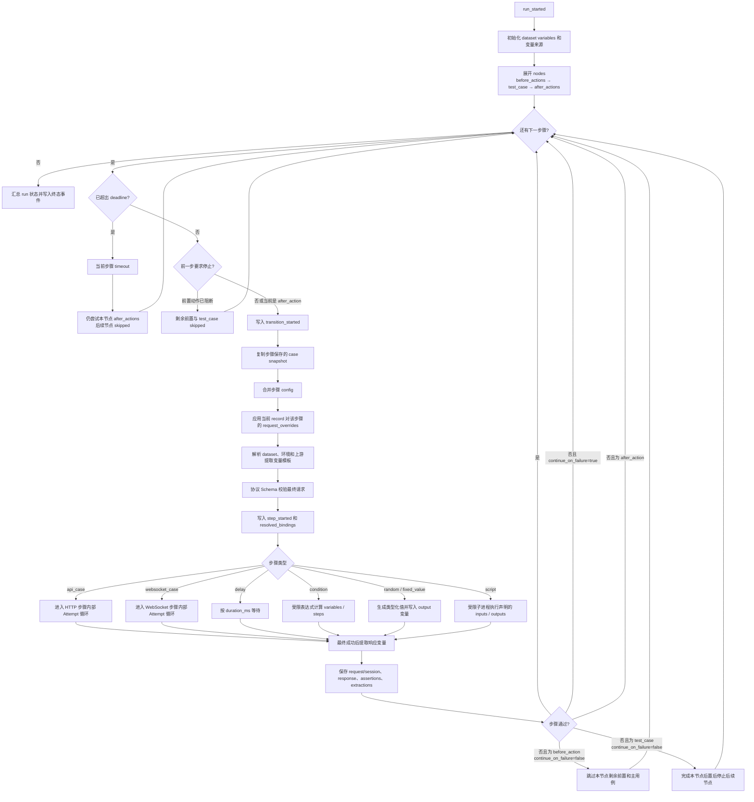
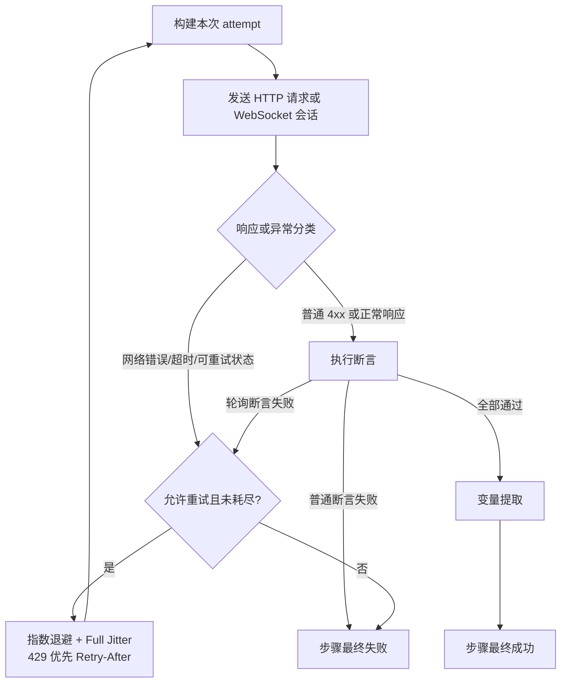
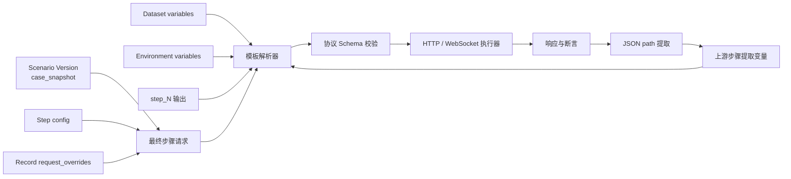
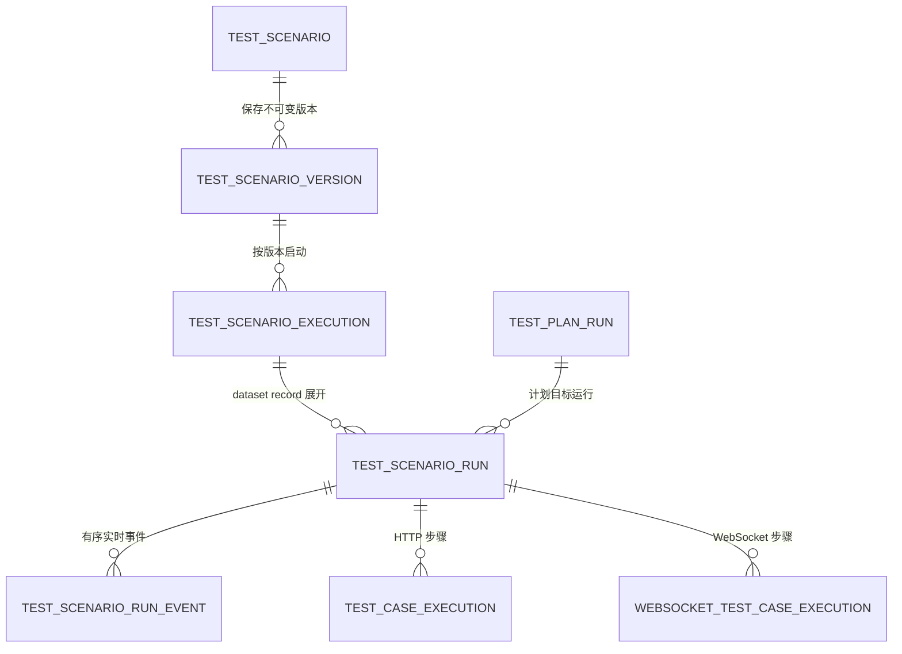

# 场景组合执行流程图谱

本文档描述当前场景组合从保存、触发、数据驱动展开、步骤执行到结果持久化的完整流程。
详细字段契约见 [场景组合接口文档](api_scenarios.md)。

## 1. 总体执行图



## 2. 单个 Record Run



节点语义：

- 每个 `nodes[]` 项只有一个 HTTP/WebSocket `test_case`，动作通过容器绑定位置。
- 前置动作阻断后仍执行本节点所有 `after_actions`；主用例失败也先完成本节点后置动作。
- 后置动作之间不使用失败停止标记，确保每个清理动作都被尝试；失败仍参与 run 终态汇总。
- 运行时只读取 `nodes`，不兼容读取 `steps/execution_phase`。

run 最终状态按步骤结果汇总：

- 任一步骤 `timeout`：run 为 `timeout`。
- 否则任一步骤 `failed`：run 为 `failed`。
- 否则：run 为 `passed`。
- `continue_on_failure=true` 只允许后续步骤继续执行，不会把当前失败步骤改为通过，因此
  最终 run 仍是 `failed`。

### 2.1 HTTP/WebSocket 步骤内部重试



重试细节由步骤内部消化，场景外层只处理最终状态。失败 attempt 不写入变量；每次尝试写入
HTTP/WebSocket 执行记录的 `attempt_history`，场景 run 详情也会返回该字段。

## 3. 请求覆盖与变量图谱



实际优先顺序：

1. 复制场景版本保存的用例请求快照。
2. 合并当前步骤 `config`。
3. 应用 record 的 `request_overrides`。
4. 解析 dataset、环境和上游变量。
5. 使用 HTTP 或 WebSocket Pydantic Schema 校验。
6. 执行并保存最终请求快照。

HTTP 覆盖支持：

- 完整 `path`
- `headers`
- `query_params`
- 嵌套 JSON `body`，支持点路径和数组索引

WebSocket 覆盖支持：

- 完整 `path`
- `headers`

## 4. 当前支持的流程

| 流程 | 支持情况 | 行为 |
| --- | --- | --- |
| 单接口串行流程 | 支持 | 多个节点按顺序执行，每节点绑定一个主用例 |
| HTTP 与 WebSocket 混合流程 | 支持 | 两类用例可在同一场景内顺序组合 |
| 等待流程 | 支持 | `delay` 动作使用非负整数 `duration_ms` |
| 条件门禁 | 支持 | `condition` 使用受限表达式读取 `variables` 和历史 `steps` |
| 随机与固定值 | 支持 | 保留 JSON 类型并通过 `output` 写入场景变量 |
| 受限脚本 | 支持 | Python/JavaScript 白名单、独立子进程、超时和声明式输入输出 |
| 失败即停 | 支持 | 默认失败后剩余步骤标记为 `skipped` |
| 失败后继续 | 支持 | 步骤设置 `continue_on_failure=true` 后继续，但 run 最终仍失败 |
| HTTP 步骤内部重试 | 支持 | 网络错误、超时、配置状态码和轮询断言可重试 |
| WebSocket 步骤内部重试 | 支持 | 每次重试重新连接并重放完整消息序列 |
| 指数退避与抖动 | 支持 | Full Jitter，429 可遵循 `Retry-After` |
| 上游响应驱动下游请求 | 支持 | JSON path 提取变量后用于 path/header/query/body/messages 等模板 |
| Dataset 变量驱动 | 支持 | 每个 dataset 提供一组基础变量 |
| Record 请求驱动 | 支持 | 每条启用 record 独立 run，并覆盖指定步骤请求字段 |
| 多数据组合执行 | 支持 | 一个 execution 可创建多个 dataset record runs |
| 空数据场景执行 | 支持 | 场景没有 dataset 时使用空变量执行一次 |
| 环境切换 | 支持 | 使用场景绑定环境或执行时指定项目内环境 |
| 手工异步执行 | 支持 | HTTP 202 返回后由 `BackgroundTasks` 执行 |
| 测试计划执行 | 支持 | 手工、Cron、Webhook 计划可执行绑定版本 |
| 实时进度与断线重放 | 支持 | 持久化 SSE、`Last-Event-ID`、心跳和运行详情恢复 |
| 请求、响应、断言审计 | 支持 | 保存步骤结果及关联 HTTP/WebSocket 执行记录 |
| 幂等执行 | 支持 | 相同幂等键和相同请求返回原 execution/runs |

## 5. 条件表达式能力

条件步骤当前允许：

- `and`、`or`、`not`
- `==`、`!=`、`>`、`>=`、`<`、`<=`
- 常量、下标访问
- 根变量 `variables` 和历史步骤结果 `steps`

示意：

```text
variables["tenant_id"] == 1001 and steps[0]["status"] == "passed"
```

条件结果为 `false` 时，该条件步骤记为失败。当前没有 `if/else` 跳转到不同步骤的 DAG 分支；
若设置 `continue_on_failure=true`，只能继续执行线性列表中的下一步骤。

## 6. 运行与事件关系



事件顺序通常为：

```text
run_queued
-> run_started
-> step_started
-> step_completed | step_failed
-> transition_started
-> ...
-> run_completed | run_failed
```

执行期间可能插入持久化 `heartbeat`。失败停止后，剩余步骤会产生 `step_skipped`。

## 7. 当前未支持

- 任意 DAG、回边和循环执行。
- 条件 true/false 跳转到不同目标步骤。
- 并行执行同一 run 内的多个步骤。
- 场景暂停、取消、手工重新运行和从失败步骤恢复。
- 按单个失败 record 或历史 run 发起外部重试。
- API 进程退出后的 queued/running 自动接管。
- 项目级场景并发限制。
- 请求覆盖敏感值的 path-aware 自动加密；当前应使用环境变量模板。
