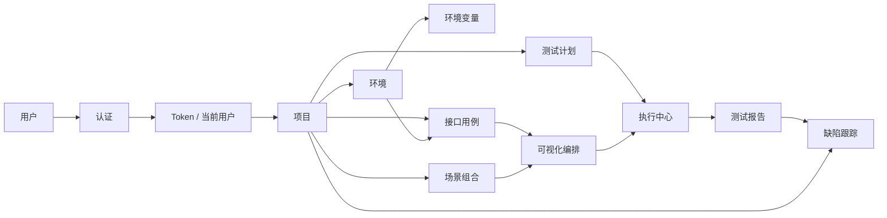

# TestAuto 技术文档

状态：当前实现
最后核验：2026-06-17

本文档用于记录 TestAuto 自动化测试平台在开发过程中的功能模块、业务逻辑、数据权限、用户权限以及它们之间的关系。后续新增或修改模块时，应同步更新本文档，避免业务规则只存在于代码或个人记忆中。

## 维护规则

- 每新增一个页面、接口、数据模型或权限规则，都需要补充到对应章节。
- 每次修改认证、菜单、数据隔离、角色权限、接口字段时，需要更新“变更记录”。
- 如果当前规则未最终确定，使用“待确认”标记，不要留空。
- 文档描述以当前代码和已确认后端接口为准。

## 当前技术栈

| 分类 | 技术 |
| --- | --- |
| 前端框架 | React 19 |
| 构建工具 | Vite |
| 语言 | TypeScript |
| 测试 | Vitest、Testing Library |
| 样式 | CSS |
| 后端接口基础路径 | `http://127.0.0.1:8000/api/v1` |
| 可配置环境变量 | `VITE_API_BASE_URL` |

## 前端目录约定

| 路径 | 说明 |
| --- | --- |
| `src/App.tsx` | 应用路由壳、导航、顶部栏、登录成功跳转 |
| `src/api/` | 后端接口封装 |
| `src/components/` | 通用 UI 组件 |
| `src/data/` | 当前前端 mock 数据和路由元数据 |
| `src/pages/` | 业务页面 |
| `src/types.ts` | 共享类型定义 |
| `src/test/` | 测试初始化 |

## 配套文档

| 文档 | 说明 |
| --- | --- |
| `AGENTS.md` | AI 开发阅读顺序、架构边界、文档同步矩阵和完成标准 |
| `docs/documentation-governance.md` | 文档分层、权威来源、状态、统一术语和自动检查 |
| `docs/frontend-performance.md` | 前端性能优化、请求竞态、列表空态、表单数据和接口封装规范 |
| `docs/test-plan-architecture.md` | 测试计划数据流、版本控制、调度、运行历史和后端责任边界 |

## 功能模块总览

| 模块 | 页面/入口 | 当前状态 | 主要职责 | 依赖数据 |
| --- | --- | --- | --- | --- |
| 登录认证 | `/login` | 已接真实接口 | 用户登录、注册、保存 token、登录后进入工作台 | `/auth/login`、`/auth/register` |
| 工作台 | `/dashboard` | 前端展示 | 全局测试执行概览、最近运行、AI 诊断入口 | `dashboardStats`、`recentRuns` |
| 项目管理 | `/projects` | 已接真实接口 | 项目列表、项目创建、项目数据权限边界入口 | `/projects` |
| 测试计划 | `/plans` | 已接真实接口 | 按项目维护计划、绑定场景版本与环境、配置调度、手动运行、查看历史、导入导出 | `/test-plans`、`/test-plan-runs`、Scenario 资产 |
| 可视化编排 | `/flow` | 已接真实接口 | 流程节点编排、节点配置、保存、导入导出和流程试运行 | `/flows`、HTTP/WebSocket 用例资产 |
| 场景组合 | `/scenarios` | 已接真实接口与 SSE | 按项目组合 HTTP/WebSocket 用例、条件和等待步骤，维护断言、数据集、变量关系并实时执行 | `/scenarios`、`/scenario-runs`、SSE 事件流 |
| 接口测试用例 | `/api` | 已接真实接口 | 统一维护 HTTP、WebSocket 用例定义、连接/请求数据、断言和响应，为自动化测试提供接口数据源 | `/test-cases`、`/websocket-test-cases` |
| 执行中心 | `/executions` | 前端展示 | 执行队列、执行状态、失败任务终止入口 | `executionRows` |
| 缺陷跟踪 | `/defects` | 已接目标接口 | 按项目记录 Bug，维护标题、指派人、类型、紧急程度、富文本内容和状态流程 | `/defects` |
| 测试报告 | `/reports` | 前端展示 | 报告指标、失败聚类、AI 分析与补充用例入口 | 页面内静态数据 |
| 环境配置 | 顶部环境下拉、导航底部按钮 | 已接真实接口 | 按项目查询和维护环境、变量与绑定用例 | `/environment-configs?project_id={project_id}` |
| 系统设置 | 路由元数据存在 | 待实现 | 用户、角色、系统配置 | 待确认 |

## 接口测试用例模块

该模块的业务定位是“接口用例资产维护”，不是执行中心。它负责沉淀可复用的接口数据源，供后续测试计划、场景组合、可视化编排和自动化执行流程引用。

### 模块职责

| 职责 | 说明 |
| --- | --- |
| 接口定义维护 | 维护请求方法、URL、接口名称、所属集合和业务描述 |
| 请求数据维护 | 维护 Params、Headers、Body、变量占位符和默认示例值 |
| 断言规则维护 | 维护状态码、响应字段、业务 code、JSONPath 等断言规则 |
| 响应维护 | 保存调试响应或手动录入的响应，便于用例设计、调试和后续编排 |
| 自动化数据源 | 被场景组合、可视化编排、测试计划和执行中心引用 |
| 统一分页 | 主列表复用 `Pagination` 与 `usePagination`，统一总数、页码、每页条数、筛选重置和页数回退行为 |

### 页面交互流程

1. 进入 `/api` 后，首先根据顶部当前选中的项目调用 `/test-cases?project_id={project_id}` 展示接口测试用例列表。
2. 列表用于浏览、筛选和定位接口用例资产，并提供单条用例运行按钮。
3. 点击“新建用例”后，弹出新增测试用例弹窗。
4. 点击列表中的某条用例后，弹出用例编辑弹窗。
5. 新增/编辑弹窗用于维护用例名称、所属集合、维护人、状态、接口方法、URL、Params、Headers、Body、断言规则和响应。
6. 新增/编辑弹窗必须支持保存、取消、调试。
7. 点击调试时，前端应把用户当前编辑的内容直接提交给后端运行，不依赖已保存版本。
8. 保存时必须携带当前项目 ID 和环境 ID，保存后的接口测试用例作为该项目、该环境下的自动化测试数据源，被场景组合、可视化编排和测试计划引用。

### 项目关联规则

| 场景 | 规则 |
| --- | --- |
| 顶部项目下拉 | 数据来自 `/projects`，用于确定当前操作项目 |
| 顶部环境下拉 | 数据来自 `/environment-configs?project_id={project_id}`，跟随当前项目切换 |
| 接口用例列表 | 使用当前项目 ID 查询 `/test-cases?project_id={project_id}` |
| 新增/编辑接口用例 | 使用当前项目 ID 调用 `/test-cases` 新增或更新，请求体必须包含当前 `environment_id` |
| 未选择项目 | 禁止新建接口用例，并提示先创建或选择项目 |
| 未选择环境 | 禁止保存和调试接口用例，并提示先选择环境 |
| 创建项目 | 项目管理页调用 `POST /projects`，创建成功后自动切换为当前项目 |

### 请求方式展示规则

接口请求方式统一支持 `GET`、`POST`、`PUT`、`PATCH`、`DELETE`、`HEAD`、`OPTIONS`。列表和新增/编辑弹窗必须使用一致的颜色标识不同请求方式，便于快速扫描接口资产。

WebSocket 用例在列表使用 `WS` 标识，并在编辑弹窗使用独立的“连接与消息”页签维护子协议、连接与接收
超时、接收数量、有序发送消息和响应提取器。HTTP 与 WebSocket 分别加载、分别保存和执行，页面不直接拼接接口。

### 调试接口约定

当前前端接口测试用例相关请求统一封装在 `src/api/apiCases.ts`：

| 接口 | 方法 | 说明 |
| --- | --- | --- |
| `/test-cases?project_id={project_id}` | `GET` | 查询当前项目下的测试用例列表 |
| `/test-cases?project_id={project_id}` | `POST` | 新增测试用例 |
| `/test-cases/{test_case_id}?project_id={project_id}` | `PUT` | 更新测试用例 |
| `/test-cases/{test_case_id}/execute?project_id={project_id}` | `POST` | 运行已保存测试用例 |
| `/test-cases/execute-unsaved?project_id={project_id}` | `POST` | 使用弹窗中当前编辑内容发起一次未保存调试运行 |
| `/environment-configs?project_id={project_id}` | `GET` | 查询当前项目环境，顶部环境下拉使用 |

前端保存时会把页面中的 Params、Headers、Body、断言规则转换为后端要求的 `query_params`、`headers`、`body_type`、`body`、`assertions` 字段，并携带当前 `environment_id`。后端接口路径如有调整，只需要同步修改对应封装文件。

### 编辑弹窗页签

| 页签 | 职责 | 调试提交字段 |
| --- | --- | --- |
| Params | 维护请求 URL 参数或查询参数，状态按钮点击切换启用/禁用 | `params` |
| Headers | 维护请求头，例如 `Content-Type`、`Authorization`；支持新增、删除、常用 Key/Value 下拉选择、手动编辑、清空后重新选择，状态按钮点击切换启用/禁用 | `headers` |
| Body | 根据类型切换编辑器：JSON 使用文本编辑、实时校验格式并支持格式化，Form Data 和 x-www-form-urlencoded 使用键值表，Raw Text 使用纯文本 | `body.type`、`body.content` |
| 断言 | 维护状态码、响应字段和业务规则断言，一行一条 | `assertions` |
| 响应 | 维护调试结果或手动录入的响应，用于编排和断言设计参考 | `exampleResponse` |

### 与其他模块的关系

| 上游/下游 | 关系 |
| --- | --- |
| 项目管理 | 接口测试用例归属于具体项目，是项目级资产 |
| 场景组合 | 场景步骤可选择接口测试用例作为步骤数据 |
| 可视化编排 | 编排节点可引用接口测试用例，组合成自动化流程 |
| 测试计划 | 当前可直接选择 HTTP/WebSocket 接口用例和已保存可视化流程；暂不支持选择场景组合 |
| 执行中心 | 执行中心消费接口测试用例数据，不在该模块维护用例资产 |
| 测试报告 | 报告记录接口用例执行结果，不反向修改接口用例定义 |

### 权限点建议

| 权限点 | 说明 |
| --- | --- |
| `api_case:view` | 查看接口测试用例 |
| `api_case:create` | 新建接口测试用例 |
| `api_case:update` | 编辑接口定义、参数、请求体、断言和响应 |
| `api_case:delete` | 删除接口测试用例 |
| `api_case:reference` | 在场景、流程或计划中引用接口测试用例 |

### 数据权限

接口测试用例应跟随项目权限隔离。用户只能查看和维护其有权限访问项目下的接口测试用例。环境变量、密钥、Token 等敏感数据不应明文展示，后续需要增加字段级脱敏规则。

## 认证模块

### 接口契约

接口基础路径：

```text
http://127.0.0.1:8000/api/v1
```

前端可通过环境变量覆盖：

```text
VITE_API_BASE_URL=http://example.com/api/v1
```

### 注册

| 项 | 内容 |
| --- | --- |
| 接口 | `/auth/register` |
| 方法 | `POST` |
| 前端封装 | `src/api/auth.ts` 的 `register` |

请求字段：

| 字段 | 必填 | 当前前端来源 |
| --- | --- | --- |
| `username` | 是 | 注册表单 |
| `avatar` | 否 | 注册表单头像地址，空值传 `null` |
| `account` | 是 | 注册表单 |
| `password` | 是 | 注册表单 |
| `phone` | 是 | 注册表单 |
| `email` | 是 | 注册表单 |

前端行为：

- 本地校验必填项、账号长度、密码长度、手机号长度、邮箱格式。
- 注册成功后清空表单并切换到登录模式。
- 接口失败时展示后端 `detail` 或通用错误文案。

### 登录

| 项 | 内容 |
| --- | --- |
| 接口 | `/auth/login` |
| 方法 | `POST` |
| 前端封装 | `src/api/auth.ts` 的 `login` |

请求字段：

| 字段 | 必填 | 当前前端来源 |
| --- | --- | --- |
| `account` | 是 | 登录表单 |
| `password` | 是 | 登录表单 |

成功后保存：

| localStorage key | 内容 |
| --- | --- |
| `access_token` | 访问受保护接口使用 |
| `refresh_token` | 后续刷新 access token 使用 |
| `token_type` | 当前为 `bearer` |
| `auth_user` | 后端返回的用户信息 JSON |

登录成功后的前端行为：

1. 保存 token 和用户信息。
2. 提示“登录成功”。
3. 跳转到 `/dashboard#/`。

### Token 使用规则

后续访问需要登录的接口时，应携带：

```http
Authorization: Bearer <access_token>
```

当前项目已通过 `src/api/client.ts` 的 `requestWithAuth` 统一处理鉴权头、Token 提前刷新和 `401` 登录过期跳转。新增受保护接口时，应优先扩展 `src/api/` 并复用统一客户端，避免在页面组件里直接拼接鉴权头。

## 用户权限模型

当前后端认证接口返回用户基础信息和 `is_active`，尚未返回角色、菜单权限或操作权限。

### 当前已知规则

| 规则 | 来源 | 前端处理 |
| --- | --- | --- |
| 账号密码错误 | `/auth/login` 返回 `401` | 展示后端错误信息 |
| 用户已禁用 | `/auth/login` 返回 `403` | 展示后端错误信息 |
| 用户是否启用 | `user.is_active` | 已存储，暂未用于菜单控制 |

### 待定义角色

| 角色 | 说明 | 数据范围 | 操作范围 | 状态 |
| --- | --- | --- | --- | --- |
| 平台管理员 | 管理全局配置、用户和权限 | 全部数据 | 全部操作 | 待确认 |
| 项目管理员 | 管理所属项目测试资产 | 所属项目 | 项目内配置和执行 | 待确认 |
| 测试负责人 | 维护计划、场景、报告 | 所属团队或项目 | 新建、编辑、执行、查看报告 | 待确认 |
| 测试执行人 | 执行测试与查看结果 | 授权项目 | 执行、查看 | 待确认 |
| 只读用户 | 查看仪表盘和报告 | 授权项目 | 只读 | 待确认 |

### 前端权限控制建议

后续后端提供权限数据后，建议拆分为：

| 权限类型 | 控制对象 | 示例 |
| --- | --- | --- |
| 菜单权限 | 页面是否可见 | 是否显示“系统设置” |
| 操作权限 | 按钮是否可点击 | 是否允许“启动执行” |
| 数据权限 | 数据查询范围 | 只能看所属项目 |
| 字段权限 | 字段是否展示或可编辑 | 敏感环境变量脱敏 |

## 数据权限模型

当前后端接口通过项目 ID 和登录用户进行数据隔离，但前端尚未接入完整角色、菜单、操作和字段权限。测试计划、场景、流程、环境和用例均应由后端校验项目归属，前端显式传递当前项目上下文。建议采用以下数据范围：

| 数据对象 | 建议归属字段 | 权限边界 |
| --- | --- | --- |
| 项目 | `project_id`、`owner_team_id` | 用户所属团队或授权项目 |
| 测试计划 | `plan_id`、`project_id` | 跟随项目权限 |
| 测试场景 | `scenario_id`、`project_id` | 跟随项目权限 |
| 接口用例 | `api_case_id`、`project_id`、`environment_id` | 跟随项目和环境权限 |
| 执行记录 | `execution_id`、`project_id`、`trigger_user_id` | 项目内可见，个人触发记录可单独筛选 |
| 测试报告 | `report_id`、`execution_id`、`project_id` | 跟随执行记录权限 |
| 缺陷 | `defect_id`、`project_id`、`assignee_id` 或 `assignee` | 跟随项目权限，状态流转和删除需要操作权限 |
| 环境配置 | `environment_id`、`project_id` | 需要单独限制编辑权限 |

## 业务逻辑关系



核心关系说明：

- 用户登录后获得 token，后续接口根据 token 识别用户身份。
- 项目是主要的数据隔离边界。
- 测试计划负责组织执行批次，绑定明确的场景版本与环境，并通过后端生成计划运行和调度记录。
- 接口测试用例是接口数据源，场景组合和可视化编排引用它来生成可执行自动化流程。
- 场景组合通过异步启动接口创建 run，并通过 SSE 事件驱动真实节点状态和连线动画；运行详情接口负责最终数据校准。
- 场景数据驱动以测试记录为最小运行单元；每条启用记录创建带 `record_id`、`record_name` 的独立 run，前端按 `run_id` 隔离实时状态并允许切换当前画布观察对象。
- 数据集只负责组织共享变量和多条记录，请求覆盖不修改原始接口定义。
- 执行中心产出执行记录。
- 测试报告基于执行记录生成。
- 缺陷跟踪按项目记录 Bug，可由报告分析入口创建，也可在缺陷模块中独立维护；状态流转由后端校验。

## 前端路由和权限预期

| 路由 | 业务模块 | 是否需要登录 | 权限点建议 |
| --- | --- | --- | --- |
| `/login` | 认证 | 否 | 无 |
| `/dashboard` | 工作台 | 是 | `dashboard:view` |
| `/projects` | 项目管理 | 是 | `project:view` |
| `/plans` | 测试计划 | 是 | `plan:view`、`plan:create`、`plan:update`、`plan:delete`、`plan:run`、`plan:history:delete` |
| `/flow` | 可视化编排 | 是 | `flow:view`、`flow:update`、`flow:run` |
| `/scenarios` | 场景组合 | 是 | `scenario:view`、`scenario:update`、`scenario:run` |
| `/api` | 接口测试用例 | 是 | `api_case:view`、`api_case:create`、`api_case:update`、`api_case:delete`、`api_case:reference` |
| `/executions` | 执行中心 | 是 | `execution:view`、`execution:start`、`execution:stop` |
| `/defects` | 缺陷跟踪 | 是 | `defect:view`、`defect:create`、`defect:update`、`defect:delete`、`defect:transition` |
| `/reports` | 测试报告 | 是 | `report:view`、`report:create_defect` |
| `/environments` | 环境配置 | 是 | `environment:view`、`environment:update` |
| `/settings` | 系统设置 | 是 | `system:manage` |

当前前端还未实现路由守卫。后续接入权限后，应在应用路由入口统一处理，而不是在每个页面重复判断。

## 接口封装规范

新增接口时建议遵循：

1. 在 `src/api/` 下按业务模块新增文件，例如 `projects.ts`、`plans.ts`。
2. 页面组件只调用 API 函数，不直接写 `fetch`。
3. 统一处理 `base_url`、JSON 解析、错误信息和鉴权头。
4. 接口返回类型在 API 文件或共享类型文件中定义。
5. 受保护接口必须自动携带 `Authorization`。

## 测试要求

| 场景 | 建议测试 |
| --- | --- |
| 认证接口 | 登录成功、登录失败、token 存储、注册成功 |
| 路由 | 登录后跳转、未登录访问受保护页面 |
| 权限 | 无权限菜单隐藏、无权限按钮禁用或不可见 |
| 数据权限 | 不同用户只能看到授权项目数据 |
| 业务流程 | 计划执行到报告生成的主流程 |
| 测试计划 | 项目隔离、计划维护、资产选择、运行记录、导入导出和后端联调 |

## 后续模块记录模板

新增模块时复制以下模板：

```md
## 模块名称

### 模块目标

说明该模块解决什么业务问题。

### 页面与入口

| 页面 | 路由 | 说明 |
| --- | --- | --- |

### 核心业务逻辑

1. 

### 数据模型

| 字段 | 类型 | 说明 | 权限/脱敏要求 |
| --- | --- | --- | --- |

### 接口

| 接口 | 方法 | 说明 | 是否鉴权 |
| --- | --- | --- | --- |

### 用户权限

| 权限点 | 说明 | 影响的 UI/接口 |
| --- | --- | --- |

### 数据权限

说明数据归属、可见范围、编辑范围。

### 测试点

| 测试点 | 预期 |
| --- | --- |
```

## 变更记录

| 日期 | 变更 | 影响模块 |
| --- | --- | --- |
| 2026-06-02 | 新增认证接口前端接入，登录成功保存 token 并跳转工作台 | 认证、应用路由 |
| 2026-06-02 | 建立技术文档，记录模块、业务逻辑、数据权限、用户权限关系 | 全局 |
| 2026-06-02 | 明确 `/api` 模块命名为接口测试用例，定位为接口资产维护和自动化测试数据源 | 接口测试用例、场景组合、可视化编排、执行中心 |
| 2026-06-02 | 新增前端性能优化文档，并优化项目、环境和测试用例请求的过期响应保护 | 全局、项目管理、环境配置、接口测试用例 |
| 2026-06-08 | 完成测试计划早期前端闭环并新增独立技术文档 | 测试计划、文档 |
| 2026-06-12 | 测试计划迁移到真实后端 CRUD、版本、调度和运行历史接口 | 测试计划、接口契约 |
| 2026-06-12 | 场景组合接入版本化 CRUD、断言、变量提取与绑定、完整运行详情和单步骤调试 | 场景组合 |
| 2026-06-12 | 场景执行升级为 `202 Accepted + SSE`，节点与连线由真实后端事件驱动，并保留详情查询作为断线恢复和最终权威数据 | 场景组合、执行架构 |
| 2026-06-15 | 数据驱动升级为数据集内多条完整测试记录，支持结构化请求字段和深层 JSON Body 覆盖 | 场景组合、接口契约 |
| 2026-06-15 | 多数据集和多测试记录执行按 run 隔离实时进度，画布支持切换观察对象并在运行历史保留记录身份 | 场景组合、执行架构 |
| 2026-06-15 | 建立 AI 开发入口、文档治理规范和自动文档检查 | 全局、文档工程 |
| 2026-06-17 | 新增缺陷跟踪模块，支持 Bug 记录、富文本内容和状态流转 | 缺陷跟踪、接口契约 |
